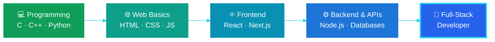

<!-- ═══════════════════════ HERO ═══════════════════════ -->

 

 

<a href="#-about-me">About</a> ·
<a href="#%EF%B8%8F-tech-stack">Stack</a> ·
<a href="#-featured-projects">Projects</a> ·
<a href="#-github-analytics">Stats</a> ·
<a href="#-my-developer-journey">Journey</a> ·
<a href="#-lets-connect">Connect</a>

 

<!-- ═══════════════════════ ABOUT ═══════════════════════ -->
## 👩‍💻 About Me

I'm an **engineering student** who learns by building. I'm strengthening my foundations in **C/C++ and Python** and moving step by step toward **full-stack development**.

| 🔭 Building | 🌱 Learning | 🎯 Goal |
| :---: | :---: | :---: |
| Web dashboards & ESP32 projects | React · Next.js · Node.js · Databases | Full-Stack Developer 🚀 |

<!-- ═══════════════════════ TECH STACK ═══════════════════════ -->
## 🛠️ Tech Stack

<table>
<tr>
<td align="center" width="190"><b>👩‍💻 Languages</b></td>
<td></td>
</tr>
<tr>
<td align="center"><b>🌐 Frontend</b></td>
<td></td>
</tr>
<tr>
<td align="center"><b>⚙️ Backend & DB</b></td>
<td></td>
</tr>
<tr>
<td align="center"><b>🔌 Hardware</b></td>
<td>
  
  
</td>
</tr>
<tr>
<td align="center"><b>🧰 Tools</b></td>
<td></td>
</tr>
</table>

<!-- ═══════════════════════ PROJECTS ═══════════════════════ -->
## 🚀 Featured Projects

<table>
<tr>
<td width="50%" valign="top">

### 🤟 Sign Language → Speech Glove

An ESP32-based glove that uses motion and flex sensors to recognize hand gestures and convert them into speech.

</td>
<td width="50%" valign="top">

### 🌐 Web Development Projects

A collection of frontend experiments built while learning HTML, CSS, JavaScript and React.

</td>
</tr>
<tr>
<td colspan="2" align="center">

### 🔧 More Projects Coming Soon

Always experimenting and adding new things to my GitHub. &nbsp;**Learning → Building → Improving**

</td>
</tr>
</table>

<!-- ═══════════════════════ STATS ═══════════════════════ -->
## 📊 GitHub Analytics

<!-- ═══════════════════════ SNAKE ═══════════════════════ -->
## 🐍 Contribution Snake

  

<!-- ═══════════════════════ JOURNEY ═══════════════════════ -->
## 🧠 My Developer Journey

<!--  -->

<!-- ═══════════════════════ CONNECT ═══════════════════════ -->
## 🌐 Let's Connect

 

**Every project is an opportunity to learn something new.** ⭐ Thanks for stopping by!

